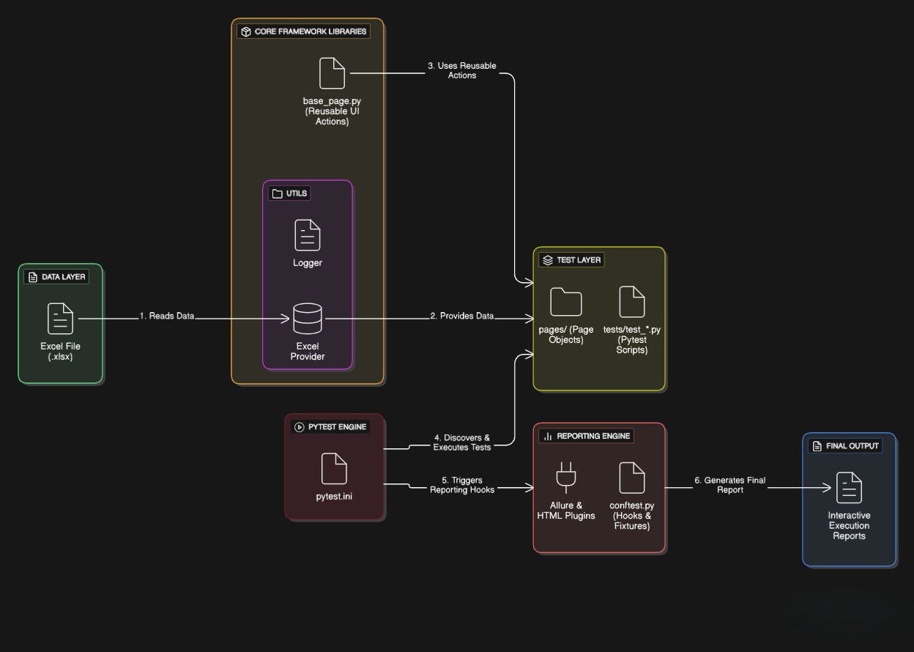
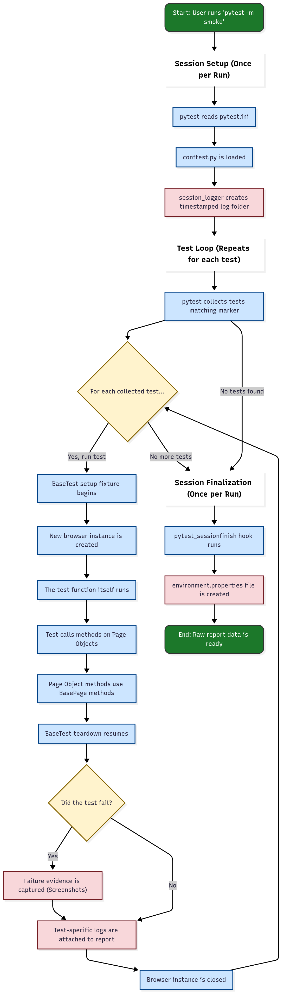

# Framework Architecture & Flow

This document provides a visual overview of the framework's components and execution lifecycle.

---

### High-Level Architecture

This diagram shows the main components of the framework and how they are related.

---

### Detailed Execution Workflow

This flowchart shows the step-by-step sequence of events during a `pytest` run.

